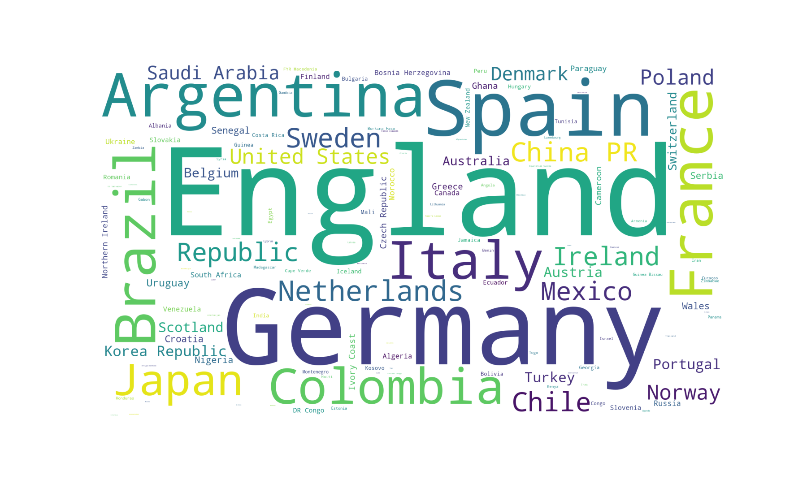
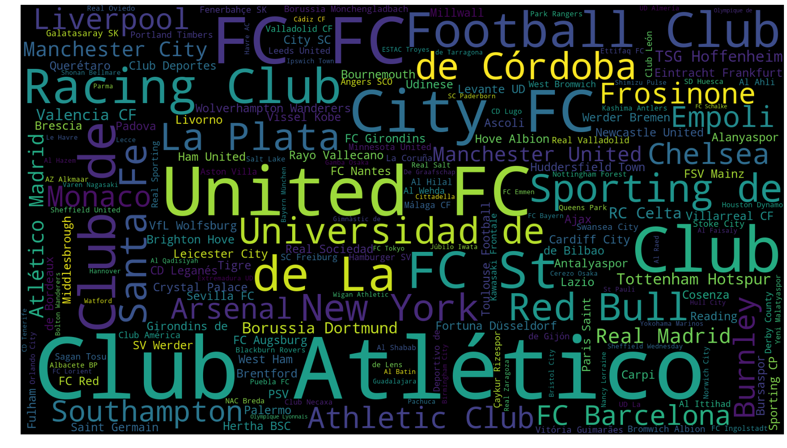
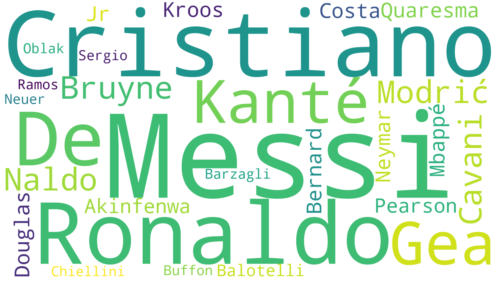
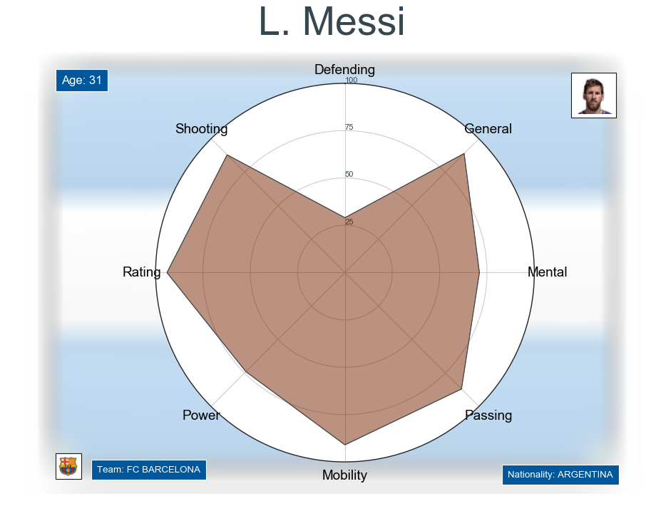
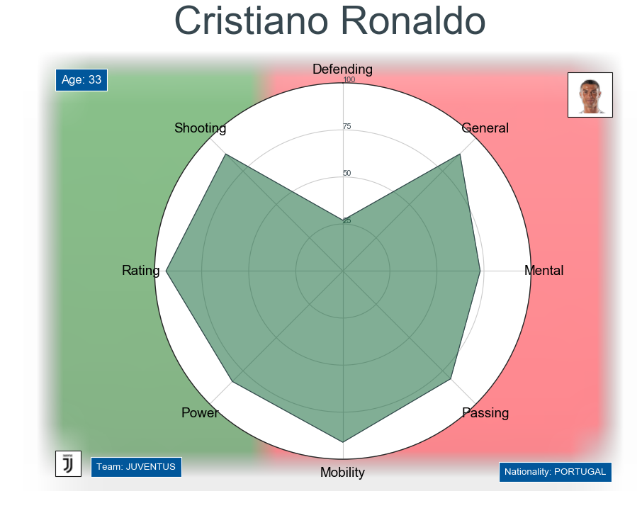

# EDA-on-FIFA-world-cup-2019

Here are some graphs created by Wordcloud liabrary :

1. Nationality of players:

2. Top Clubs

3. Best players

## The final visulization looks like this :

__Like this their are 17917 players__ 

